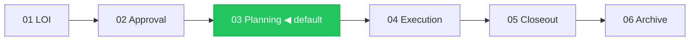
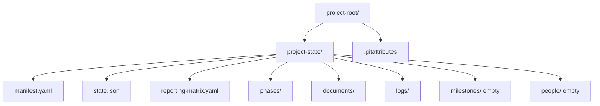

> Codex adapter: Read [CODEX.md](../../CODEX.md) before using this skill.

# Project Scaffolder

## Purpose

Stand up a fresh `project-state/` in a new working directory. Ensures the facility starts correctly-shaped so the other `project-*` skills can operate.

Used once per project at kickoff. The experience runs as a 6-step wizard with a post-confirm build step.

Before Step 1, inspect files and source documents the operator supplied or
explicitly placed in scope. Pre-fill only directly supported values and preserve
their attribution. Do not extrapolate objectives, milestones, contacts,
eligibility, capabilities, automation, or delivery surfaces. Ask only unresolved
schema-required, pack-driven, or routing-critical questions, grouped by topic.
The directory tree, IDs, schema, templates, and generated paths remain exactly as
defined below.

## Trigger phrases

- "set up a new project"
- "scaffold a project"
- "initialize project-state" / "init project-state"
- "create a new project-state"
- "start a new funded project" / "bootstrap a grant project"
- "new consortium project"

---

## Codex interaction

Use ordinary Markdown for all steps: a progress line, Mermaid diagram where it
clarifies the phase or gate, compact tables, and numbered choices. Pre-filled
source-supported values appear as attributed confirmation rows. Group unresolved
required, pack-driven, or routing-critical questions and wait for the operator's
answer before advancing. No files are written before the Step 6 confirmation.

## Wizard Steps

Cover steps 1–6 in sequence. Collapse source-resolved steps into attributed
confirmation rows and group remaining questions; do not re-ask known values. Do
not write any files until the operator confirms in Step 6.

---

### Step 1: Pack Selection

**Purpose:** Choose which compliance pack(s) to load. Packs seed the reporting matrix and configure the six profile-driven skills.

Preselect only a pack explicitly requested or directly supported by an inspected
source, show the supporting source, and require confirmation. A capability or
surface keyword is not a pack selection and must not enable anything.

**Codex output:**
```
── Step 1 of 6: Pack Selection ──────────────────────────────────

Which compliance pack(s) fit your project? Select one or more.

| # | Pack              | Best for                                   | Maturity   |
|---|-------------------|--------------------------------------------|------------|
| 1 | pic-pcais         | Protein Industries Canada PCAIS consortium | 🟢 Prod    |
| 2 | grant-canada      | Canadian grants (NSERC, IRAP, SIF + 12)    | 🟡 Starter |
| 4 | client-services   | Client engagement, QBR cadence             | 🟡 Starter |
| 5 | board-investor    | Board and investor reporting               | 🟡 Starter |
| 6 | agile-default     | Engineering team, sprint cadence           | 🟡 Starter |
| 7 | open-source       | Community-governed open-source             | 🟡 Starter |
| 8 | None / custom     | Bare presets — configure manually          | —          |

> Type a number (e.g. 2 or 2 3 for multiple):
```

---

### Step 2: Phase Selection

**Purpose:** Set the starting phase. The phase determines which gate criteria are active and which phase manifests are marked CURRENT.

**`phases.lifecycle` — write only what the pack settles, and never ask here.** Scaffolding is not the
moment to raise a question the operator cannot yet answer; `project-onboarding` Q1.7 asks it properly,
pre-filled from the same pack data.

Read `defaults.lifecycle` from the manifest of each pack selected in Step 1. Then:

- **Any selected pack declares `terminal`** → write `phases.lifecycle: terminal`. Nothing is being
  guessed: the pack is asserting that projects of its kind end, and for grant packs the preset makes
  `continuous` structurally impossible anyway.
- **Packs declare `continuous`, or disagree, or declare nothing** → **leave it unset.** A `continuous`
  pack default is a *suggestion*, and scaffold time is the point of least information — writing it here
  would create `increments/` on a facility nobody has confirmed continues.
- **No pack selected** → leave it unset.

Do not hardcode a pack-to-lifecycle table in this skill. The mapping lives in pack manifests, per the
packs-configure-not-code principle; `FB-003` is what happens when pack knowledge is encoded in a skill
instead. Unset means terminal, is permanently valid, and is never warned about, so leaving it is always
the safe answer — and the post-closeout diagnostic asks at the moment the answer is actually knowable.

The lifecycle resolution rules above are authoritative for this public adapter.

**`phases.preset` — write it, always.** This is the key FB-003 is about: five presets shipped in
`templates/phase-presets/` and nothing ever wrote the manifest key that selects one, so choosing a
ladder meant hand-editing YAML for ten weeks. Resolution order:

1. The intake record's `phases.preset`, when called from `project-onboarding` Q1.9.
2. The selected pack's declared default preset.
3. Otherwise ASK. This is the interactive front door and a one-line question is cheap; a facility with
   no ladder is not.

Never leave it unset. Unlike `phases.lifecycle`, where unset is a permanently valid answer meaning
terminal, an unset preset means there is no phase ladder to be in.

**`automation.timezone` — write it, and never invent it.** `templates/manifest-v2.yaml` has marked
this REQUIRED since it shipped while shipping the value as `~`, and no skill collected it (FB-002).
Resolution order:

1. The intake record's `automation.timezone`, from `project-onboarding` Q1.8.
2. Otherwise ASK for an IANA name. The host machine's zone may be offered as a suggestion to confirm,
   never written unseen — the facility's timezone is a property of the PROJECT, not of whoever ran the
   command, and a project worked on from two machines in two zones would silently reschedule itself.

Do not write `~`, do not default to UTC. `project-automator` now refuses to compile a schedule without
it, because the window above is local time and a guessed zone fires the nightly jobs at the wrong hour
— confidently wrong beats not starting, which is why the refusal is the correct behaviour and this
question is the thing that stops anyone meeting it.

Both keys are ruled in decision `2026-08-21-twelve-rulings-facility-contract`, items 10 and 11.


**Codex output:**
```
── Step 2 of 6: Phase Selection ─────────────────────────────────



| # | Phase           | When to choose                        |
|---|-----------------|---------------------------------------|
| 1 | 01 — LOI        | Still writing the application         |
| 2 | 02 — Approval   | Applied, waiting for decision         |
| 3 | 03 — Planning ✓ | Award confirmed, MPA in progress      |
| 4 | 04 — Execution  | Project already underway              |

> Type a number [default: 3]:
```

---

### Step 3: Project Identity

**Purpose:** Collect project name, funder, program, PI/PL, and dates. These seed `manifest.yaml`.

**Codex output:**
Present the unresolved identity fields as one grouped prompt, preserving any
source-supported values as attributed confirmations:
```
── Step 3 of 6: Project Identity ────────────────────────────────

Confirm or complete the unresolved project identity fields below.

  - Project short name (used as slug, e.g. atlas)
  - Project long name
  - Funder / sponsor and program / contract
  - Project Lead name and email
  - Project start date and optional end date
  - Proposal / source-document path, if supplied
```
After the response, confirm the resolved identity block and surface only remaining
required gaps.

---

### Step 4: Consortium & Sharing

**Purpose:** Capture consortium members, the Project Lead organization, and the team sharing model.

**Codex output:**
```
── Step 4 of 6: Consortium & Sharing ────────────────────────────

  Lead organization:
  Consortium members (org, role, email — one per line, blank to finish):

  Sharing model:
  | # | Model         | Description                                      |
  |---|---------------|--------------------------------------------------|
  | 1 | Git ✓         | project-state/ in a git repo — recommended       |
  | 2 | Shared drive  | Dropbox / GDrive / OneDrive, no git              |
  | 3 | Single user   | Local only                                       |

> Sharing model [default: 1]:
```

---

### Step 5: Surfaces

**Purpose:** Configure which external surfaces the project uses. Surface config is stored in `manifest.yaml:surfaces` and read by `project-notifier`.

**Codex output:**
```
── Step 5 of 6: Surfaces ────────────────────────────────────────

Which surfaces does the team use? Toggle on/off.

| # | Surface          | Status | What it does                              |
|---|------------------|--------|-------------------------------------------|
| 1 | Slack            | [ ]    | Posts updates to a channel                |
| 2 | Gmail            | [ ]    | Creates drafts (never auto-sends)         |
| 3 | Google Calendar  | [ ]    | Proposes meeting holds                    |
| 4 | scsiwyg blog     | [ ]    | Publishes posts through a review queue    |

> Type numbers to enable (e.g. 1 2), or press Enter to skip:
```

---

### Step 6: Review & Confirm

**Purpose:** Show the complete configuration before writing anything. Nothing touches the filesystem until the user confirms here.

**Codex output:**
```
── Step 6 of 6: Review & Confirm ───────────────────────────────

Review your configuration. Nothing is written until you confirm.

  Project:    [long name] ([slug])
  Pack(s):    [packs]
  Phase:      [phase]
  Funder:     [funder]
  Lead org:   [org]
  Consortium: [N members]
  Surfaces:   [enabled]
  Sharing:    [model]
  Git:        [yes/no]



  **1** Confirm and scaffold
  **2** Go back and change something

>
```

---

### Step 7: Build Output (post-confirm)

Triggered immediately after the user confirms in Step 6. Write all files now.

**Codex output:**
```
── Scaffolded ✓ ─────────────────────────────────────────────────

| Status | Path                                        | Note                           |
|--------|---------------------------------------------|--------------------------------|
| ✅     | project-state/manifest.yaml                 | 3 TODOs remain                 |
| ✅     | project-state/state.json                    | Phase: [selected]              |
| ✅     | project-state/reporting-matrix.yaml         | Seeded from [pack] defaults    |
| ✅     | project-state/automation/tasks.yaml         | Compiled from matrix           |
| ✅     | project-state/logs/activity.ndjson          | project.scaffolded event       |
| ✅     | .gitattributes                              | merge=union on logs            |
| ✅     | Git repo initialized                        | No commit made                 |
| ⬜     | project-state/milestones/                   | Empty — seed later             |
| ⬜     | project-state/people/                       | Empty — add later              |
| ⬜     | project-state/lessons-learned/               | Empty — capture later          |

Next steps:
  **1** Seed milestones from proposal    → /project-milestone-manager
  **2** Add team members                 → /project-state
  **3** Checkpoint to git                → /project-git checkpoint
  **4** Done for now
```

---

## Git initialization

After files are written (Step 7), initialize git if the git sharing model was selected:

1. Run `git rev-parse --git-dir`. If already inside a repo, skip `git init` — only add the `.gitattributes` entry if missing.
2. Run `git init` in the project root (if no repo exists).
3. Write `.gitattributes` to the project root:
   ```
   # project-state git merge configuration
   # Append-only logs: keep all lines from both sides (never a real conflict)
   project-state/logs/*.ndjson merge=union
   ```
4. Leave the new files uncommitted. Offer `project-git checkpoint` as a separate,
   deliberate action; never stage or commit as part of scaffolding.

If shared-drive model: skip git entirely. Note in Step 7 output: "Git checkpointing is available if you switch to git sharing later."

---

## Discipline

- **Never write files before Step 6 confirmation.** The entire wizard is read-only until the user confirms.
- **Idempotent, CONDITIONALLY.** Invoked directly with no intake record: if `project-state/` already
  exists, abort before Step 1 with a warning and offer `project-state validate` instead. Called WITH
  an intake record (see "Parameterised invocation" below): **adopt** the existing tree — never
  overwrite, never clear — because re-orientation is a supported path where an existing facility is
  the premise, not a mistake. Same rule and same word as capability `enable` step 5. A blanket abort
  broke `project-onboarding`'s re-orientation flow, which calls this skill in Chapter 8 against a
  facility that already exists (FB-001).
- **Never overwrite existing files.**
- **Atomic failure.** If scaffolding aborts mid-way, clean up anything partially created.
- **Consistent presentation.** Use the Markdown interaction format throughout.
- **One step at a time.** Generate one Markdown step, wait for response, then generate the next. Do not bundle multiple steps.

---

## Parameterised invocation

This skill has two front doors, and only one of them is the wizard.

**Interactive.** A person runs it directly; Steps 1–6 interview them; nothing is written before
confirmation. If `project-state/` exists, it aborts (see Discipline).

**From an intake record.** `project-onboarding` Chapter 8 calls this skill with its captured intake
record as structured input: *"Call `project-scaffolder` with all captured inputs, passing the working
intake record as structured input. Do not re-ask questions that have already been answered."* In this
mode the wizard does not run — every value it would have asked for is supplied — and an existing
`project-state/` is **adopted** rather than refused, because onboarding also serves re-orientation of
a live facility.

This contract existed and worked for months while documented only in the caller. It is written here
because a callee that refuses its own documented caller is not discoverable from either side alone
(FB-001).

### `seed-matrix`

`project-onboarding` also invokes `project-scaffolder seed-matrix` to seed
`project-state/reporting-matrix.yaml` from the selected packs. Merge semantics: entries whose `id`
already exists are left alone — an operator's edit outranks a pack default. Also undocumented until
2026-08-21, and for the same reason.

---

## Integration

- **project-state** — all subsequent reads/writes route through it (once scaffolded).
- **project-document-curator** — offered in Step 7 next-steps for proposal ingestion.
- **project-milestone-manager** — offered in Step 7 next-steps for milestone seeding.
- **project-phase-gate** — becomes active once scaffolded.
- **project-git** — git initialization is part of scaffolding; `project-git` handles all subsequent checkpointing, pushing, and syncing.
- **project-onboarding** — the deeper context-gathering experience; runs after scaffolding to fill references/ with goals, examples, and stakeholder context.
